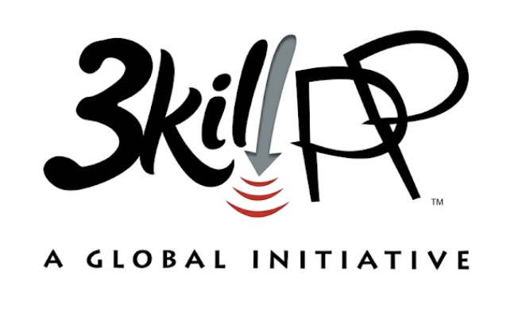

# 3GPP Expert — Claude Plugin + Skill

Turns Claude into a senior 3GPP telecommunications consultant — covering everything from GSM (1992) through 6G (Release 21). Ships in two forms from one repo:

- **Claude Code plugin** (installed via `/plugin marketplace`) — for CLI/IDE usage
- **Claude Skill bundle** (`.skill` file) — for claude.ai, Claude Desktop, and Claude for Work

<p align="center">
  
</p>

## What It Does

Deep, standards-grounded expertise across the full 3GPP ecosystem:

- **All generations**: 2G/GSM, 3G/UMTS, 4G/LTE, 5G NR, 5G-Advanced, 6G
- **All releases**: Phase 1 through Release 21, with detailed feature breakdowns
- **Protocol stacks**: PHY, MAC, RLC, PDCP, SDAP, RRC, NAS — with LTE vs NR differences
- **Core network**: EPC to 5GC/SBA evolution, all network functions (AMF, SMF, UPF, etc.)
- **Deployment**: Network planning, spectrum strategy, migration paths (NSA/SA options), O-RAN
- **Security**: Authentication (EPS-AKA, 5G-AKA), SUPI/SUCI, IMSI catcher analysis
- **Practical consulting**: Link budgets, cell planning, troubleshooting, interoperability

Auto-triggers on any mention of 3GPP, a RAT (GSM/UMTS/LTE/NR), a protocol layer (RRC/NAS/PDCP/MAC/PHY), a 5G feature (slicing/URLLC/MIMO/NTN/RedCap), or any TS spec number.

## Example Questions It Handles

**Deep protocol questions:**
> "Walk me through how a UE scans for and selects the best cell, from power-on to RRC Connected."

**PHY layer precision:**
> "What sequence is used for PSS in 5G NR?" — correctly answers m-sequence (not Zadoff-Chu, a common AI hallucination)

**Cross-generation comparisons:**
> "Explain the differences between LTE and 5G NR RRC state machines. What is RRC_INACTIVE?"

**Security analysis:**
> "How does 5G's SUPI/SUCI mechanism protect against IMSI catchers? What vulnerabilities remain?"

**Deployment planning:**
> "We're migrating from LTE/EPC to 5G on a budget. Walk me through the NSA vs SA options."

## Installation

### Option A — Claude Code (CLI / IDE)

This repo is a single-plugin Claude Code marketplace. From inside Claude Code:

```text
/plugin marketplace add lugasia/3gpp-skill
/plugin install 3gpp-expert@3gpp-skill
```

The skill auto-triggers on any 3GPP-related question.

**Local development install** (without publishing):

```bash
git clone https://github.com/lugasia/3gpp-skill.git
claude --plugin-dir ./3gpp-skill
```

### Option B — claude.ai (web)

Skills are available on Pro, Max, Team, and Enterprise plans.

1. Download [`3gpp-expert.skill`](./3gpp-expert.skill) from this repo (it's a zipped skill bundle).
2. In claude.ai, open **Settings → Capabilities → Skills** (exact wording may vary by plan).
3. Click **Upload skill** and select the `.skill` file.
4. Start a new conversation — the skill auto-triggers on 3GPP topics.

### Option C — Claude Desktop (Mac / Windows)

1. Download [`3gpp-expert.skill`](./3gpp-expert.skill).
2. Double-click the file — Claude Desktop will prompt to install it, **or** go to **Settings → Skills → Upload**.
3. Start a new conversation.

### Option D — Claude for Work / Enterprise ("Cowork")

Same flow as claude.ai (Option B). On Team/Enterprise plans, a workspace admin can upload the skill once at the **organization level** so it's available to every member. The setting is under **Admin → Capabilities → Skills** in the workspace console (exact label may vary).

> If the upload UI isn't visible on your plan, check with your workspace owner — Skills may need to be enabled at the org level first. See Anthropic's official Skills documentation for the current UI.

### Option E — Manual install (any surface that reads a skill directory)

Copy `skills/3gpp-expert/` to wherever your client looks for skills (for Claude Code personal scope: `~/.claude/skills/3gpp-expert/`):

```text
~/.claude/skills/3gpp-expert/
├── SKILL.md
└── references/
    ├── releases.md
    ├── phy-layer.md
    └── working-groups.md
```

## Repo Layout

```
3gpp-skill/
├── .claude-plugin/
│   ├── plugin.json          # plugin manifest
│   └── marketplace.json     # single-plugin marketplace manifest
├── skills/
│   └── 3gpp-expert/
│       ├── SKILL.md         # main skill prompt
│       └── references/
│           ├── releases.md
│           ├── phy-layer.md
│           └── working-groups.md
├── 3gpp-expert.skill        # prebuilt zip bundle for claude.ai / Desktop / Cowork upload
├── LICENSE
└── README.md
```

| Path | Purpose |
|------|---------|
| `.claude-plugin/plugin.json` | Claude Code plugin manifest (name, version, author, keywords) |
| `.claude-plugin/marketplace.json` | Marketplace manifest — lets users add this repo via `/plugin marketplace add` |
| `skills/3gpp-expert/SKILL.md` | Main skill instructions — 7 knowledge domains, critical PHY facts, response patterns, when to web search |
| `skills/3gpp-expert/references/releases.md` | Release-by-release reference (Phase 1 → Rel-21) with spec series table |
| `skills/3gpp-expert/references/phy-layer.md` | PHY deep-dive: PSS/SSS sequences, physical channels, reference signals, RACH preambles, channel mapping |
| `skills/3gpp-expert/references/working-groups.md` | RAN/SA/CT Working Group structure with owned specs and typical topics |
| `3gpp-expert.skill` | Zipped copy of `skills/3gpp-expert/` for non-CLI clients |

## Coverage

### Releases

| Era | Releases | Key Technologies |
|-----|----------|-----------------|
| 2G | Phase 1 – Rel-98 | GSM, GPRS, EDGE |
| 3G | Rel-99 – Rel-7 | UMTS, WCDMA, HSPA, HSPA+ |
| 4G | Rel-8 – Rel-14 | LTE, LTE-A, LTE-A Pro, NB-IoT, C-V2X |
| 5G | Rel-15 – Rel-17 | NR, 5GC/SBA, NTN, RedCap, Sidelink |
| 5G-Adv | Rel-18 – Rel-19 | AI/ML, XR, Ambient IoT, MIMO evolution |
| 6G | Rel-20 – Rel-21 | Sub-THz, ISAC, AI-native, digital twins |

### Specification Series

Covers TS 21–38 series with go-to specs for architecture (TS 23.501), NR radio (TS 38.xxx), NAS (TS 24.501), security (TS 33.501), and more.

## Contributing

Contributions are welcome. If you spot an inaccuracy, want to add coverage for a specific topic, or have suggestions:

1. Open an issue describing the improvement.
2. Fork the repo and submit a PR against `skills/3gpp-expert/` (that's the canonical source for both the plugin and the `.skill` bundle).
3. After changing `SKILL.md` or any `references/*.md`, **rebuild the bundle** so claude.ai / Desktop users get the update:
   ```bash
   cd skills/3gpp-expert && zip -r ../../3gpp-expert.skill SKILL.md references/
   ```
4. Make sure any spec references are accurate and cite the correct TS/TR numbers.

## Support This Project

If you find this useful, consider supporting its development:

- [GitHub Sponsors](https://github.com/sponsors/lugasia)
- Star this repo to help others find it

## License

MIT License — see [LICENSE](LICENSE) for details.

---

Built by [@lugasia](https://github.com/lugasia)
