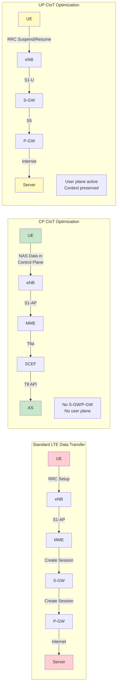
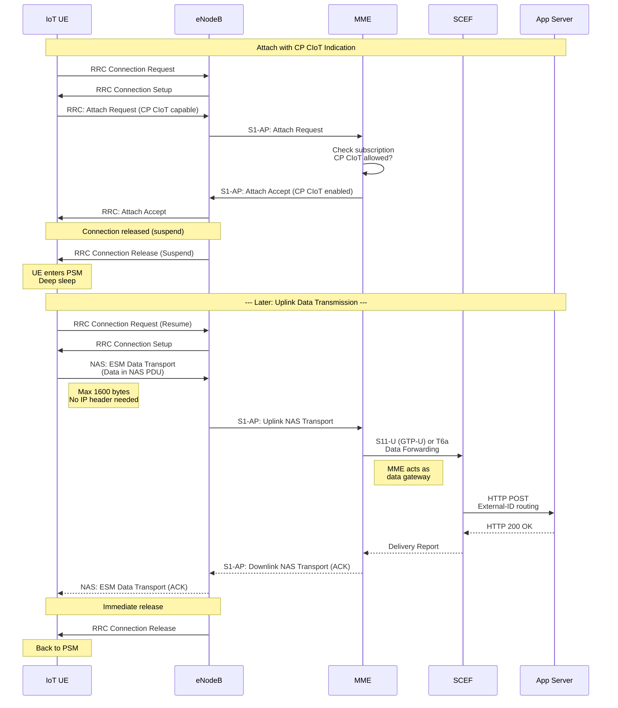
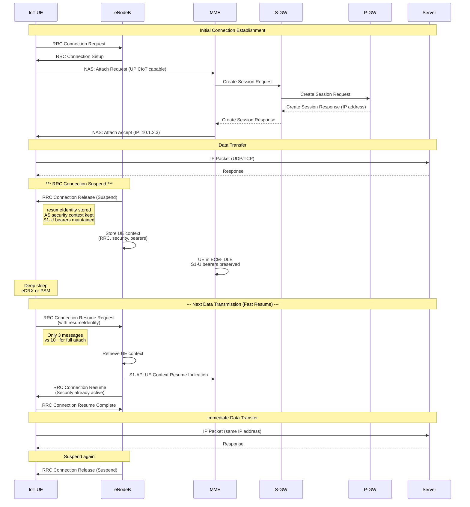
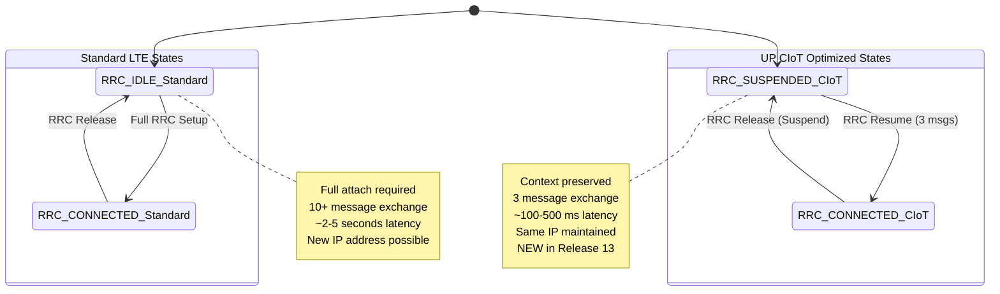
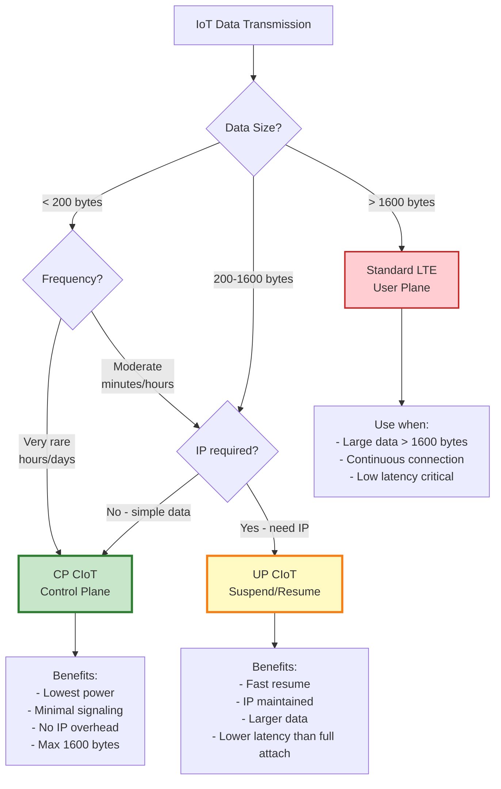
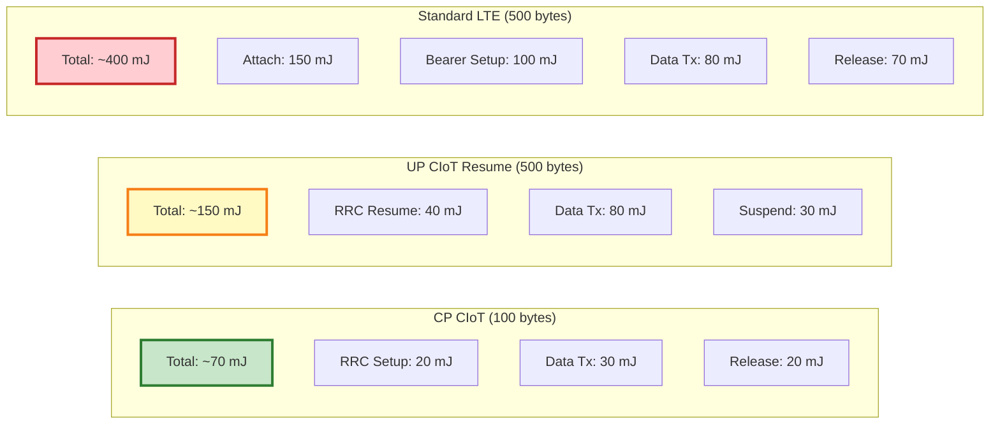

# CIoT EPS Optimizations

## Cellular IoT Optimizations Overview (Release 13)

These optimizations dramatically reduce power consumption and signaling overhead for NB-IoT and LTE-M devices.

### Optimization Comparison



## Control Plane CIoT Optimization

### Message Flow



### NAS PDU Structure for CP CIoT

```
ESM Data Transport Message (TS 24.301 §8.3.21)
┌─────────────────────────────────────────┐
│ Protocol Discriminator (EPS SM = 0x2)  │ 1 byte
├─────────────────────────────────────────┤
│ EPS Bearer Identity (0x0 for default)  │ 4 bits
├─────────────────────────────────────────┤
│ Procedure Transaction ID                │ 4 bits
├─────────────────────────────────────────┤
│ Message Type (0xD9)                     │ 1 byte
├─────────────────────────────────────────┤
│ User Data Container                     │
│   - Data length (2 bytes)               │
│   - Data payload (max 1600 bytes)       │ Variable
├─────────────────────────────────────────┤
│ Optional: Release Assistance Indication │ TLV
│   - Indicates no more data follows      │
└─────────────────────────────────────────┘
```

## User Plane CIoT Optimization

### RRC Suspend/Resume Flow



### State Comparison



## Optimization Decision Tree



## Power Consumption Comparison

### Energy per Transmission



## Signaling Overhead Comparison

| Metric | CP CIoT | UP CIoT (Resume) | Standard LTE |
|--------|---------|------------------|--------------|
| **Messages (UL+DL)** | 6-8 | 10-12 | 20-30 |
| **Signaling Bytes** | ~200 bytes | ~500 bytes | ~2000 bytes |
| **Time to Data** | ~100-300 ms | ~100-500 ms | ~2-5 seconds |
| **UE Power (mAh per tx)** | ~0.02 mAh | ~0.04 mAh | ~0.11 mAh |
| **Battery Life Impact** | 10+ years | 7-10 years | 2-5 years |
| **Network Load** | Lowest | Low | High |

## Configuration Requirements

### HSS Subscription Profile

```json
{
  "imsi": "234501234567890",
  "msisdn": "+44780012345",
  "apnConfiguration": {
    "apn": "iot.ciot.operator.com",
    "pdnType": "Non-IP",
    "ciotOptimization": {
      "cpCiot": {
        "enabled": true,
        "maxDataSize": 1600
      },
      "upCiot": {
        "enabled": true,
        "allowSuspend": true
      }
    }
  },
  "ratRestrictions": ["NB-IoT", "LTE-M"],
  "subscribedPeriodicRauTauTimer": 86400,
  "subscribedActiveTime": 60
}
```

### MME Configuration

```
CIoT Optimization Policy:
  CP CIoT:
    Enabled: Yes
    Max Data Size: 1600 bytes
    Allowed RATs: NB-IoT, Cat-M1
    Priority: High (prefer over UP CIoT for small data)

  UP CIoT:
    Enabled: Yes
    RRC Suspend Timeout: 3600 seconds
    Context Storage: 100000 UEs
    Allowed RATs: NB-IoT, Cat-M1

  Fallback:
    If CIoT fails: Standard EPS procedures
    Max retries: 3
```

## Performance Metrics

### Latency Breakdown

```
CP CIoT (100 byte transmission):
├── RRC Connection Setup: 50-100 ms
├── NAS Attach (if needed): 100-200 ms (cached: 0 ms)
├── Data in NAS signaling: 30-50 ms
├── SCEF processing: 20-50 ms
└── Total: 200-400 ms (subsequent: 100-150 ms)

UP CIoT Resume (500 byte transmission):
├── RRC Resume: 30-70 ms
├── Data transmission: 50-100 ms
└── Total: 80-170 ms

Standard LTE (500 byte transmission - cold start):
├── RRC Setup: 50-100 ms
├── Attach procedure: 200-500 ms
├── PDN connection: 300-700 ms
├── Data transmission: 50-100 ms
└── Total: 600-1400 ms
```

## Key Specifications

- **TS 23.401**: GPRS enhancements for E-UTRAN access
  - §5.3.4b: Control Plane CIoT EPS Optimization
  - §5.3.4c: User Plane CIoT EPS Optimization
  - §5.3.4a: Extended DRX for power saving
- **TS 24.301**: NAS protocol for EPS; Stage 3
  - §8.3.21: ESM DATA TRANSPORT message
  - §9.9.4.2B: ESM cause for CIoT optimization
- **TS 36.331**: E-UTRA RRC Protocol specification
  - §5.3.13: RRC connection suspend and resume procedures
- **TS 23.682**: Architecture enhancements to facilitate communications with packet data networks and applications
  - NIDD delivery for CP CIoT optimization
- **TS 36.321**: E-UTRA MAC protocol specification
  - Early Data Transmission (EDT) for CP CIoT

## Use Case Examples

### CP CIoT: Smart Metering
```
Application: Electricity meter reporting
Data: 80 bytes (meter reading + timestamp)
Frequency: Every 4 hours
Battery: 3000 mAh (AA cell)

Calculation:
- Transmissions per day: 6
- Energy per transmission: 0.02 mAh
- Daily consumption: 0.12 mAh
- Sleep current (PSM): 0.005 mA
- Daily sleep consumption: 0.12 mAh
- Total daily: 0.24 mAh
- Battery life: 3000 / 0.24 / 365 = 34 years
```

### UP CIoT: Asset Tracking
```
Application: Container GPS tracker
Data: 200 bytes (GPS + sensors)
Frequency: Every 15 minutes (while moving)
Battery: 5000 mAh (C cell)

Calculation:
- Transmissions per day: 96
- Energy per transmission: 0.04 mAh
- Daily consumption: 3.84 mAh
- Sleep current (eDRX): 0.05 mA
- Daily sleep consumption: 1.20 mAh
- Total daily: 5.04 mAh
- Battery life: 5000 / 5.04 / 365 = 2.7 years
```
