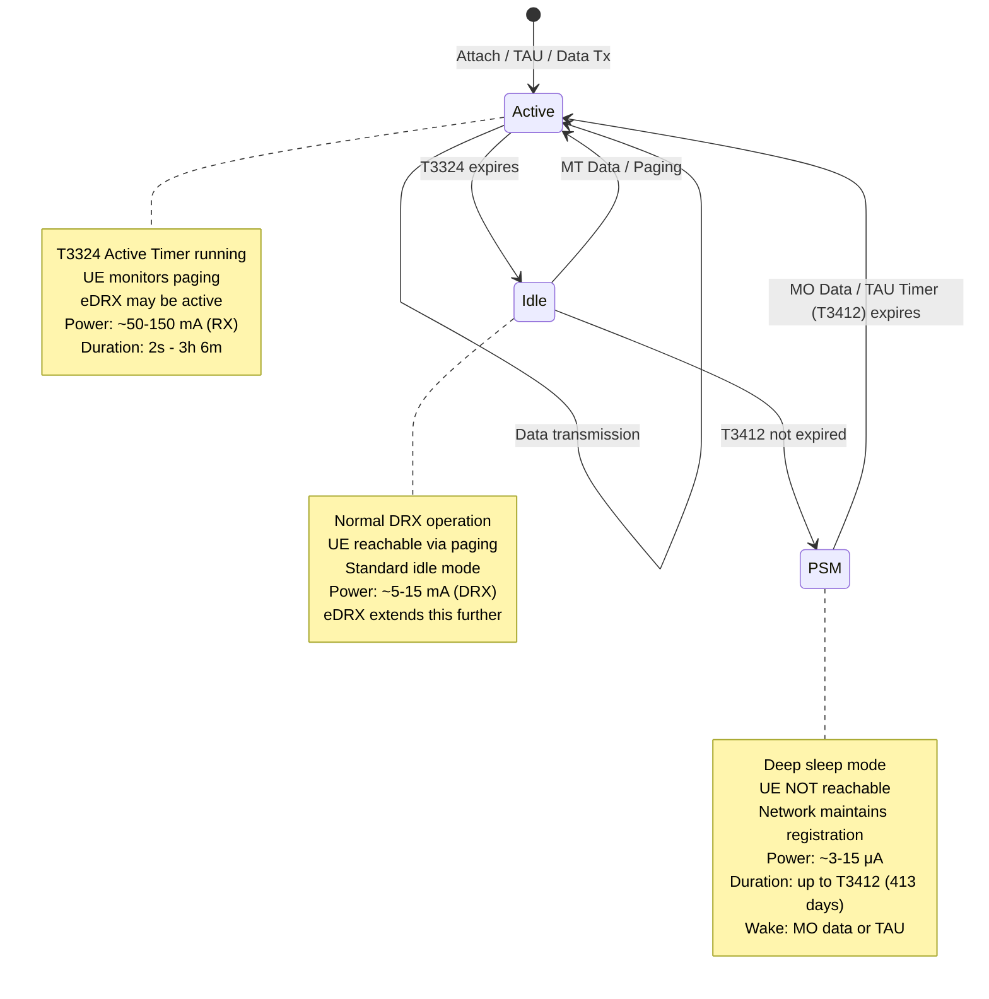
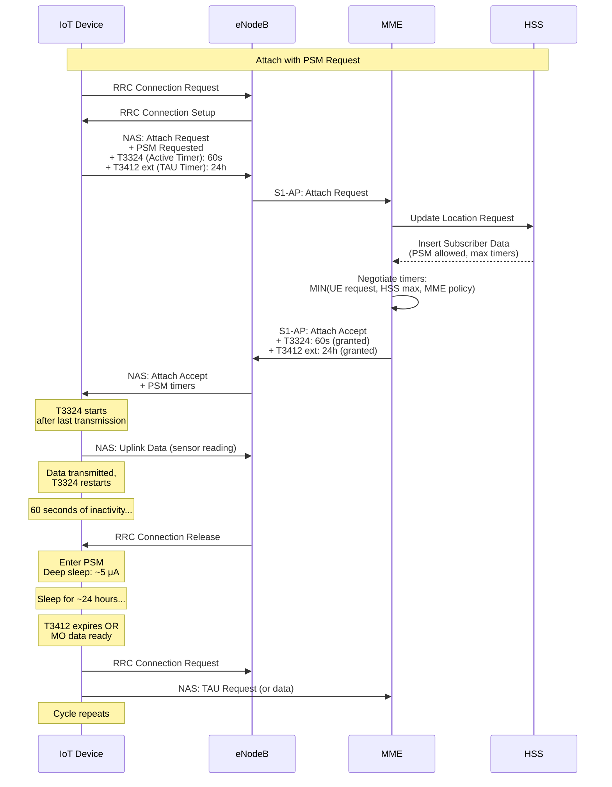
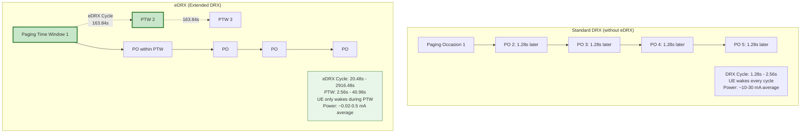
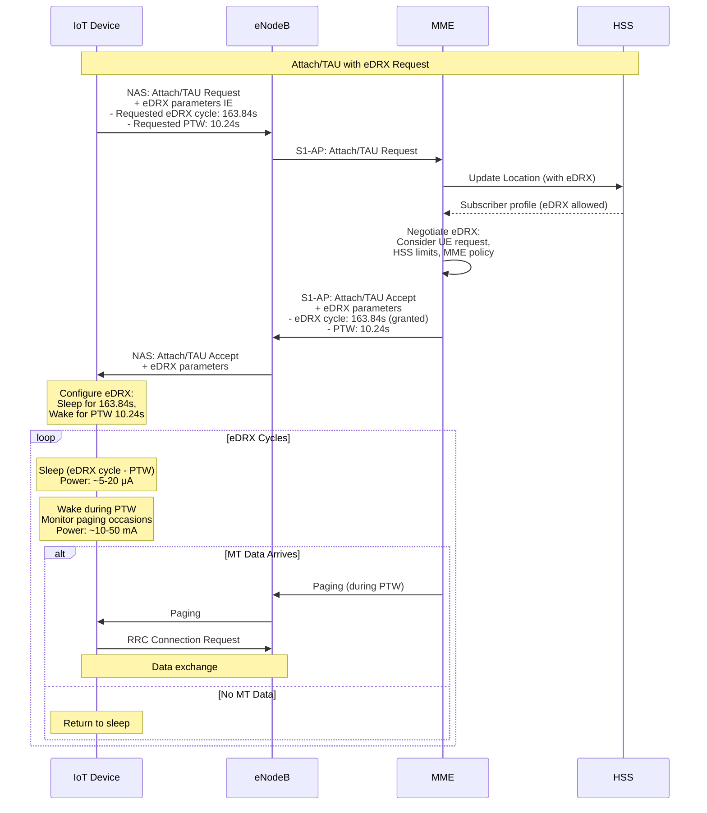
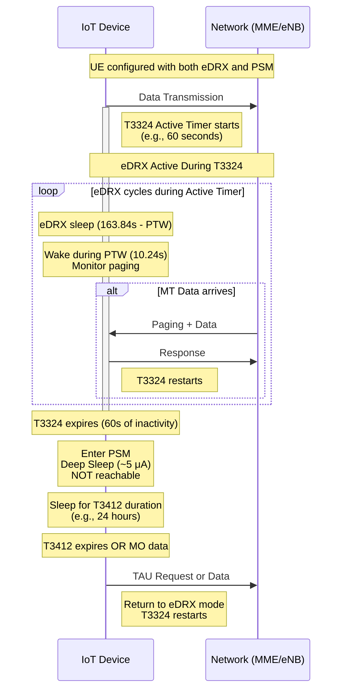

# eDRX and PSM Power Saving Mechanisms

## Power Saving Mode (PSM) - Release 12

### PSM State Machine



### PSM Timer Configuration



### PSM Timing Diagram

```
Time (hours) →
0          1          2          3          4         24        25
│          │          │          │          │          │         │
├──┬───────┴──────────┴──────────┴──────────┴─────────┬┴─────────┤
│  │                                                   │          │
│  └─ T3324 (60s)                                      │          │
│     Active: Can RX paging                            │          │
│                                                      │          │
├───────────────────────── PSM ─────────────────────────          │
│                  (Deep Sleep: ~5 μA)                            │
│                                                                 │
└────────────────── T3412 extended (24 hours) ────────────────────┘
                                                    TAU or MO Data

Power:
  Active (T3324):      ████████░░░░░░░░░░░░░░░░░░░░░░░░░░░░░░ (~100 mA)
  PSM:                 ░░░░░░░░▁▁▁▁▁▁▁▁▁▁▁▁▁▁▁▁▁▁▁▁▁▁▁▁▁▁▁▁ (~5 μA)

Network Perspective:
  - UE remains registered (no Detach)
  - S1 context preserved at MME
  - No paging during PSM period
  - MT data buffered or delivered at next wake
```

## Extended DRX (eDRX) - Release 13

### eDRX Timing Mechanism



### eDRX Cycle Values (NB-IoT / LTE-M)

```
eDRX Cycle Length (seconds):
┌─────┬──────────┬──────────┬──────────┐
│Value│  WB-E-UTRAN │ NB-IoT  │  Meaning  │
├─────┼──────────┼──────────┼──────────┤
│ 0   │   5.12   │  10.24   │ Shortest  │
│ 1   │  10.24   │  20.48   │           │
│ 2   │  20.48   │  40.96   │           │
│ 3   │  40.96   │  81.92   │           │
│ 4   │  61.44   │ 163.84   │ Default   │
│ 5   │  81.92   │ 327.68   │           │
│ 6   │ 102.40   │ 655.36   │           │
│ 7   │ 122.88   │ 1310.72  │           │
│ 8   │ 143.36   │ 2621.44  │           │
│ 9   │ 163.84   │ 2621.44  │ Longest   │
│ 10  │ 327.68   │ 2621.44  │           │
│ 11  │ 655.36   │ 2621.44  │           │
│ 12  │ 1310.72  │ 2621.44  │           │
│ 13  │ 2621.44  │ 2621.44  │ Max       │
└─────┴──────────┴──────────┴──────────┘

PTW (Paging Time Window) Length (seconds):
┌─────┬──────────┬──────────┐
│Value│  WB-E-UTRAN │ NB-IoT  │
├─────┼──────────┼──────────┤
│ 0   │   2.56   │   2.56   │ Shortest
│ 1   │   5.12   │   5.12   │
│ 2   │   7.68   │   7.68   │
│ 3   │  10.24   │  10.24   │ Default
│ 4   │  12.80   │  15.36   │
│ 5   │  15.36   │  20.48   │
│ 6   │  17.92   │  40.96   │ Longest
│ 7   │  20.48   │  61.44   │
│ 8   │  24.00   │  81.92   │
│ 9   │  28.80   │ 102.40   │
│ 10  │  33.28   │ 163.84   │
│ 11  │  35.84   │ 327.68   │
│ 12  │  40.96   │ 327.68   │
│ 13  │  61.44   │ 327.68   │
│ 14  │  81.92   │ 327.68   │
│ 15  │ 102.40   │ 327.68   │ Max
└─────┴──────────┴──────────┘
```

### eDRX Configuration Flow



### eDRX Power Consumption Detail

```
eDRX Cycle Example: 163.84 seconds, PTW: 10.24 seconds

Timeline (one eDRX cycle):
0s        10.24s              163.84s
│◄────────►│◄──────────────────►│
│   PTW    │    Deep Sleep     │
│          │                   │
└──────────┴───────────────────┘

During PTW (10.24s):
├─ Paging Occasion 1 (~40ms active)  ─ 10-50 mA
├─ Sleep (~1.24s)                   ─ 5-20 μA
├─ Paging Occasion 2 (~40ms active)  ─ 10-50 mA
├─ Sleep (~1.24s)                   ─ 5-20 μA
│  ... (8 POs total in 10.24s)
└─ Average: ~1-3 mA during PTW

Deep Sleep (153.6s):
└─ Power: ~5-20 μA

Total eDRX Cycle Energy:
  PTW: 10.24s × 2 mA = 20.48 mAs = 0.0057 mAh
  Sleep: 153.6s × 0.01 mA = 1.536 mAs = 0.0004 mAh
  Total per cycle: 0.0061 mAh
  Cycles per day: 86400 / 163.84 = 527
  Daily consumption: 3.2 mAh

Battery Life (3000 mAh):
  3000 / 3.2 / 365 = 2.6 years
```

## Combined PSM + eDRX

### Hybrid Operation



### State Power Consumption

```
State Transition Power Profile:

Power (mA)
  100 │
      │ ██
   50 │ ██
      │ ██
   10 │ ██ ▄▄  ▄▄  ▄▄  ▄▄  ▄▄
    1 │ ██▀▀▀▀▀▀▀▀▀▀▀▀▀▀▀▀▀▀▀▀
  0.1 │ ██▄▄▄▄▄▄▄▄▄▄▄▄▄▄▄▄▄▄▄▄
 0.01 │                     ▁▁▁▁▁▁▁▁▁▁▁▁▁▁▁
0.001 │                     ▔▔▔▔▔▔▔▔▔▔▔▔▔▔▔
      └─┬──┬────────────────┬──────────────→ Time
       TX│◄─── T3324 ─────►│◄──── PSM ───→
        eDRX (60s)         Deep Sleep (24h)

Legend:
  ██ : Data transmission (~100 mA)
  ▄▄ : Paging monitoring during PTW (~10-50 mA)
  ▀▀ : eDRX sleep between PTW (~0.01-0.05 mA)
  ▁▁ : PSM deep sleep (~0.003-0.015 mA)
```

## Configuration Recommendations

### Use Case: Smart Meter (Read-Only)

```yaml
Device: Electricity smart meter
Data: 100 bytes every 4 hours
MT Data: Rare (firmware update notification)

Recommended Configuration:
  PSM:
    Enabled: Yes
    T3324 (Active Timer): 30 seconds
    T3412 ext (TAU Timer): 24 hours
    Reason: Minimal MT data, maximize sleep

  eDRX:
    Enabled: Yes
    eDRX Cycle: 655.36 seconds (~11 minutes)
    PTW: 5.12 seconds
    Reason: Allows MT during T3324 window

Expected Battery Life: 15-20 years (3000 mAh AA cell)
```

### Use Case: Asset Tracker (Bidirectional)

```yaml
Device: GPS container tracker
Data: 200 bytes every 15 minutes (while moving)
MT Data: Frequent (route updates, geofence alerts)

Recommended Configuration:
  PSM:
    Enabled: Yes
    T3324 (Active Timer): 10 minutes
    T3412 ext (TAU Timer): 4 hours
    Reason: Allow MT commands during movement

  eDRX:
    Enabled: Yes
    eDRX Cycle: 81.92 seconds
    PTW: 10.24 seconds
    Reason: Frequent MT data, lower latency

Expected Battery Life: 2-3 years (5000 mAh C cell)
```

### Use Case: Wearable Health Monitor

```yaml
Device: Medical sensor (heart rate, SpO2)
Data: 150 bytes every 5 minutes
MT Data: Moderate (threshold alerts, config changes)

Recommended Configuration:
  PSM:
    Enabled: Limited
    T3324 (Active Timer): 5 minutes
    T3412 ext (TAU Timer): 2 hours
    Reason: Frequent data, moderate MT

  eDRX:
    Enabled: Yes
    eDRX Cycle: 20.48 seconds
    PTW: 7.68 seconds
    Reason: Low latency for health alerts

Expected Battery Life: 7-10 days (500 mAh coin cell, rechargeable)
```

## NAS Information Elements

### eDRX Parameters IE (TS 24.301 §9.9.3.10A)

```
Extended DRX parameters
┌────────────────────────────────────┐
│ IEI: 0x6E (eDRX)              │ 1 byte
├────────────────────────────────────┤
│ Length: 0x01                  │ 1 byte
├────────────────────────────────────┤
│ eDRX value (bits 1-4)         │ 4 bits
│ Paging time window (bits 5-8) │ 4 bits
└────────────────────────────────────┘

Example: eDRX cycle = 163.84s, PTW = 10.24s (NB-IoT)
  eDRX value: 0100 (4 = 163.84s for NB-IoT)
  PTW value:  0011 (3 = 10.24s)
  Encoded: 0x43
```

### PSM Timers IE (TS 24.008 §10.5.5.6, §10.5.5.32)

```
T3324 value (GPRS Timer 2) IE:
┌────────────────────────────────────┐
│ IEI: 0x38                     │ 1 byte
├────────────────────────────────────┤
│ Length: 0x01                  │ 1 byte
├────────────────────────────────────┤
│ Timer value (bits 1-5)        │ 5 bits
│ Unit (bits 6-8)               │ 3 bits
│   000 = 2 seconds             │
│   001 = 1 minute              │
│   010 = decihours (6 minutes) │
└────────────────────────────────────┘

Example: T3324 = 60 seconds
  Unit: 000 (2 seconds)
  Value: 11110 (30 × 2 = 60 seconds)
  Encoded: 0x1E

T3412 extended value (GPRS Timer 3) IE:
┌────────────────────────────────────┐
│ IEI: 0x39                     │ 1 byte
├────────────────────────────────────┤
│ Length: 0x01                  │ 1 byte
├────────────────────────────────────┤
│ Timer value (bits 1-5)        │ 5 bits
│ Unit (bits 6-8)               │ 3 bits
│   000 = 10 minutes            │
│   001 = 1 hour                │
│   010 = 10 hours              │
│   011 = 2 seconds             │
│   101 = 30 minutes            │
│   111 = deactivated           │
└────────────────────────────────────┘

Example: T3412 = 24 hours
  Unit: 001 (1 hour)
  Value: 11000 (24 hours)
  Encoded: 0x38
```

## Monitoring and KPIs

### Network KPIs for PSM/eDRX

```
PSM-Related Metrics:
├─ PSM Activation Success Rate
│  Target: > 98%
│  Formula: (Successful PSM entries / PSM requests) × 100
│
├─ PSM Early Wake Rate
│  Target: < 2%
│  Formula: (Early wakes / Total PSM periods) × 100
│  Causes: MT data, network-initiated procedures
│
├─ Average PSM Duration
│  Target: Should match T3412 configuration
│  Monitor: Deviation indicates issues
│
└─ PSM Battery Saving Gain
   Formula: (Standard idle - PSM consumption) / Standard idle
   Expected: 90-99% reduction

eDRX-Related Metrics:
├─ eDRX Paging Success Rate
│  Target: > 95% within PTW
│  Formula: (Pages delivered in PTW / Total pages) × 100
│
├─ Average eDRX Cycle Deviation
│  Target: < 5% from configured
│  Monitor: Network synchronization
│
├─ PTW Utilization
│  Formula: (POs with paging / Total POs in PTW) × 100
│  Optimize: If too low, increase eDRX cycle
│
└─ eDRX Power Efficiency
   Expected: 50-70% reduction vs standard DRX
```

## Troubleshooting

### Common Issues

```
Issue: UE not entering PSM despite configuration

Diagnosis:
1. Check MME logs for PSM rejection
   └─> Cause: Subscription issue, HSS config
2. Verify T3324 timer granted vs requested
   └─> Network may reduce timer
3. Check for periodic network-initiated procedures
   └─> Reattach, bearer modification preventing PSM
4. Verify UE implementation of PSM
   └─> Some devices may not fully support

Resolution:
- Align HSS subscription with required timers
- Disable unnecessary network procedures for IoT APNs
- Update UE firmware if needed

Issue: High paging failure during eDRX

Diagnosis:
1. Check eDRX cycle vs PTW ratio
   └─> If eDRX cycle too long, synchronization issues
2. Verify network eDRX capability
   └─> Some cells may not support long eDRX
3. Check UE clock drift
   └─> Poor oscillator causes PTW misalignment
4. Monitor cell reselection during eDRX
   └─> Mobility causes PTW loss

Resolution:
- Reduce eDRX cycle length
- Enable eDRX synchronization (hyperframe alignment)
- Use temperature-compensated crystal oscillators (TCXO)
- Adjust eDRX for mobile vs stationary UEs
```

## Key Specifications

- **TS 24.008**: Mobile radio interface Layer 3 specification; Core network protocols; Stage 3
  - §10.5.5.6: GPRS Timer (T3324)
  - §10.5.5.32: GPRS Timer 3 (T3412 extended)
- **TS 24.301**: NAS protocol for EPS; Stage 3
  - §9.9.3.10A: Extended DRX parameters
  - §9.9.4.x: ESM information elements for PSM/eDRX
- **TS 23.401**: GPRS enhancements for E-UTRAN access
  - §4.3.5.10: Power Saving Mode (PSM)
  - §5.3.4a: Extended DRX (eDRX)
- **TS 23.682**: Architecture enhancements to facilitate communications with packet data networks and applications
  - §5.13.7: PSM and eDRX monitoring events via SCEF
- **TS 36.331**: E-UTRA RRC protocol specification
  - DRX configuration for eDRX support
- **TS 36.304**: E-UTRA UE procedures in idle mode
  - Paging reception during eDRX PTW
