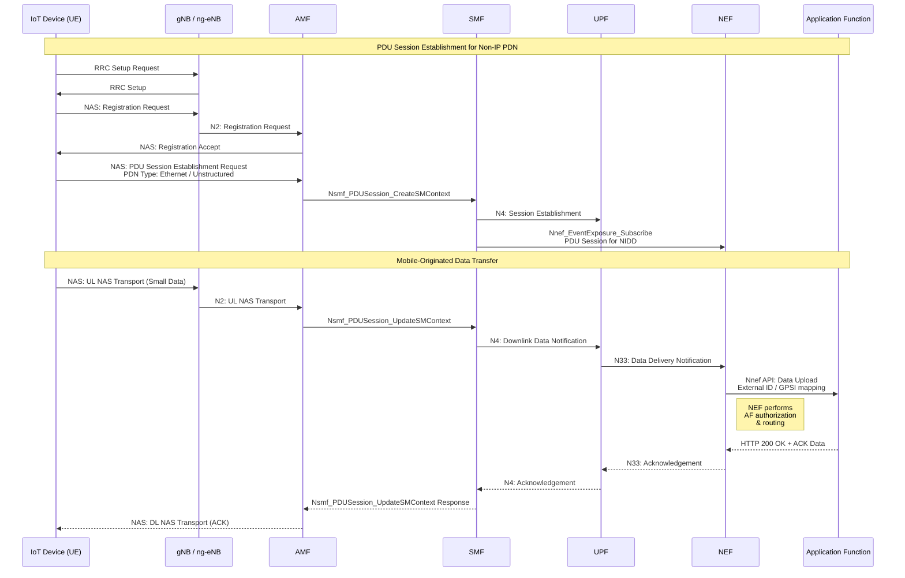
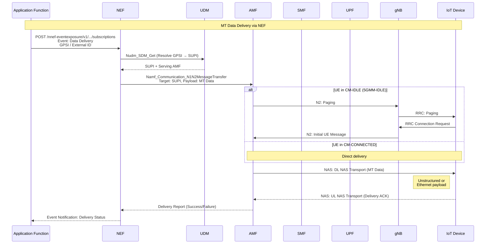
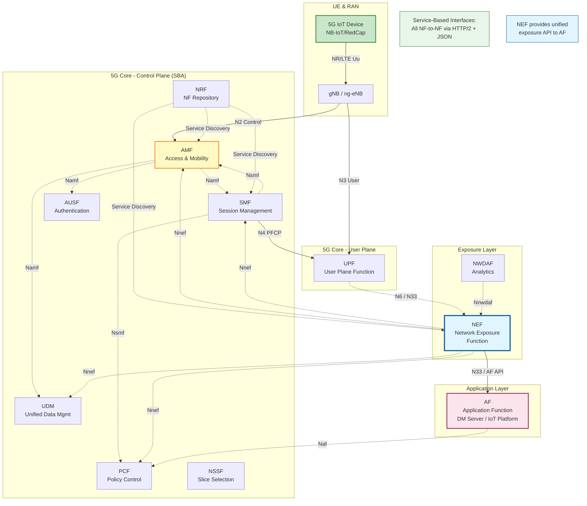
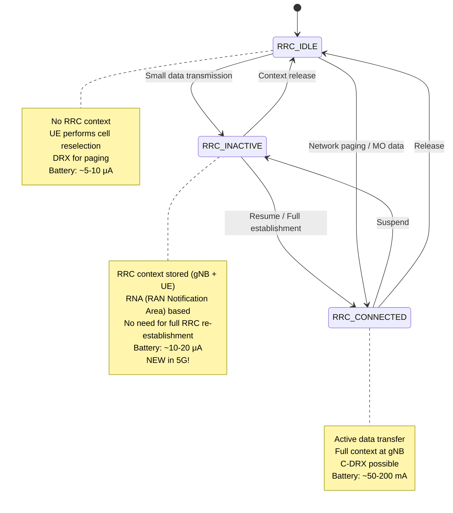

# NIDD Architecture: 5G with NEF

## Non-IP Data Delivery in 5G System (Release 15+)

### 5G NIDD Architecture with NEF



### Mobile-Terminated Data via NEF



### 5G Service-Based Architecture for NIDD



## NEF Exposure APIs for NIDD

### Nnef Service Operations (3GPP TS 29.522)

| Service Operation | Description | HTTP Method |
|-------------------|-------------|-------------|
| **Nnef_EventExposure** | Subscribe to UE events (reachability, location, etc.) | POST /subscriptions |
| **Nnef_TrafficInfluence** | Request traffic routing influence | POST /traffic-influence |
| **Nnef_PFDmanagement** | Packet Flow Description management | POST /pfd-management |
| **Nnef_AFsessionWithQoS** | Request QoS for AF session | POST /af-sessions |
| **Nnef_ChargeableParty** | Identify chargeable party | POST /chargeable-party |
| **Nnef_NIDD** | Non-IP Data Delivery | POST /nidd-configurations |

### NIDD Configuration API

```json
POST /nnef-nidd/v1/{afId}/configurations HTTP/2
Host: nef.operator.com
Content-Type: application/json
Authorization: Bearer <OAuth2_token>

{
  "externalId": "sensor-device-12345",
  "msisdn": "+44780012345",
  "niddConfiguration": {
    "mtcProviderId": "IoTProvider123",
    "duration": 86400,
    "reliableDataService": true,
    "rdsPorts": {
      "uplinkPort": 5000,
      "downlinkPort": 5001
    },
    "pdnEstablishmentOption": "DYNAMIC"
  },
  "notificationDestination": "https://iotplatform.example.com/notifications"
}
```

### MT Data Delivery Request

```json
POST /nnef-nidd/v1/{afId}/deliver HTTP/2
Host: nef.operator.com
Content-Type: application/json

{
  "externalId": "sensor-device-12345",
  "data": "SGVsbG8gSW9UIGV2aWNl",  // Base64 encoded
  "reliableDataService": true,
  "requestedRetransmissionTime": "2026-04-15T14:30:00Z",
  "deliveryWaitTime": 300
}
```

### Delivery Report Notification

```json
POST /notifications HTTP/2
Host: iotplatform.example.com
Content-Type: application/json

{
  "transaction": "txn-789012",
  "deliveryStatus": "SUCCESS",
  "externalId": "sensor-device-12345",
  "timestamp": "2026-04-15T14:25:33Z",
  "rdsPort": 5001
}
```

## NIDD vs Standard PDU Session

| Aspect | NIDD (Non-IP) | Standard PDU Session |
|--------|---------------|---------------------|
| **PDN Type** | Ethernet / Unstructured | IPv4 / IPv6 / IPv4v6 |
| **IP Address** | Not assigned | UE gets IP address |
| **Routing** | Via NEF to AF (external ID) | Standard IP routing |
| **Data Size** | Small (optimized for <1 KB) | Any size (standard MTU) |
| **Latency** | Optimized (control plane option) | Standard |
| **Power Consumption** | Lowest (CP optimization) | Higher (full user plane) |
| **Use Case** | Sensor data, alarms, commands | Video, browsing, bulk data |
| **NAT/Firewall** | Not applicable | May require consideration |

## 5G Power Saving Mechanisms

### RRC States in 5G



## Key Specifications

- **TS 23.501**: System architecture for the 5G System (5GS)
  - §5.6.7: Support for Non-IP PDU Session
  - §6.2.8: Network Exposure Function (NEF)
- **TS 23.502**: Procedures for the 5G System
  - §4.13.6: NIDD procedures
  - §4.15: Network capability exposure procedures
- **TS 29.522**: 5G System; Network Exposure Function Northbound APIs
  - NIDD configuration and delivery APIs
  - Event exposure for UE reachability
- **TS 38.331**: NR Radio Resource Control (RRC)
  - RRC_INACTIVE state procedures
  - Small Data Transmission (SDT)
- **TS 24.501**: NAS protocol for 5GS
  - PDU Session Establishment for Non-IP

## Evolution from SCEF to NEF

| Feature | SCEF (4G) | NEF (5G) | Improvement |
|---------|-----------|----------|-------------|
| **API Style** | RESTful (T8) | Service-based HTTP/2 | More scalable |
| **Authentication** | API keys / OAuth | OAuth 2.0 mandatory | Stronger security |
| **Analytics** | Limited | Via NWDAF integration | AI/ML insights |
| **Network Slicing** | Not supported | Full support | Isolation & QoS |
| **Event Framework** | Device-specific | Unified event exposure | Consistent API |
| **Charging** | Basic | Integrated with CHF | Fine-grained |
