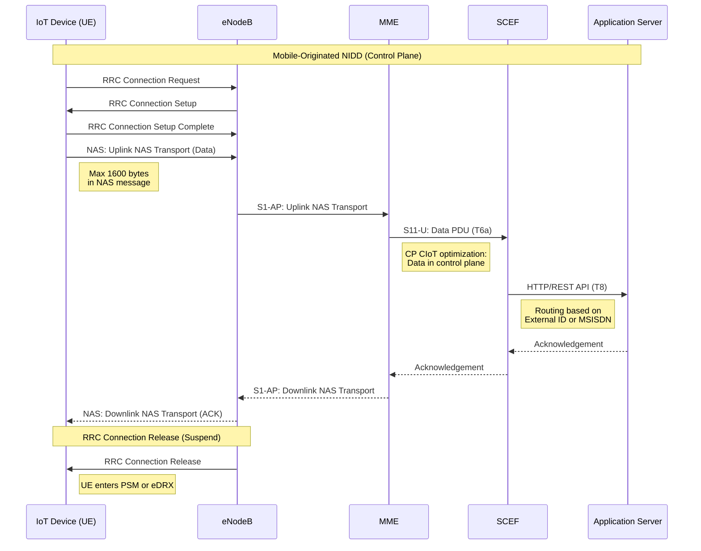
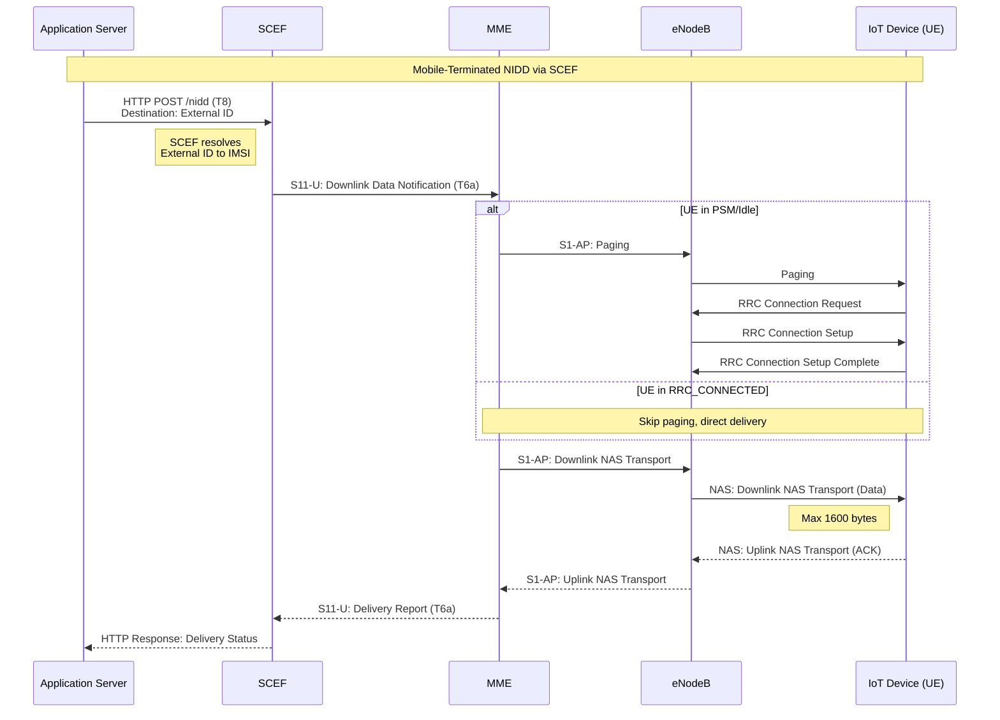
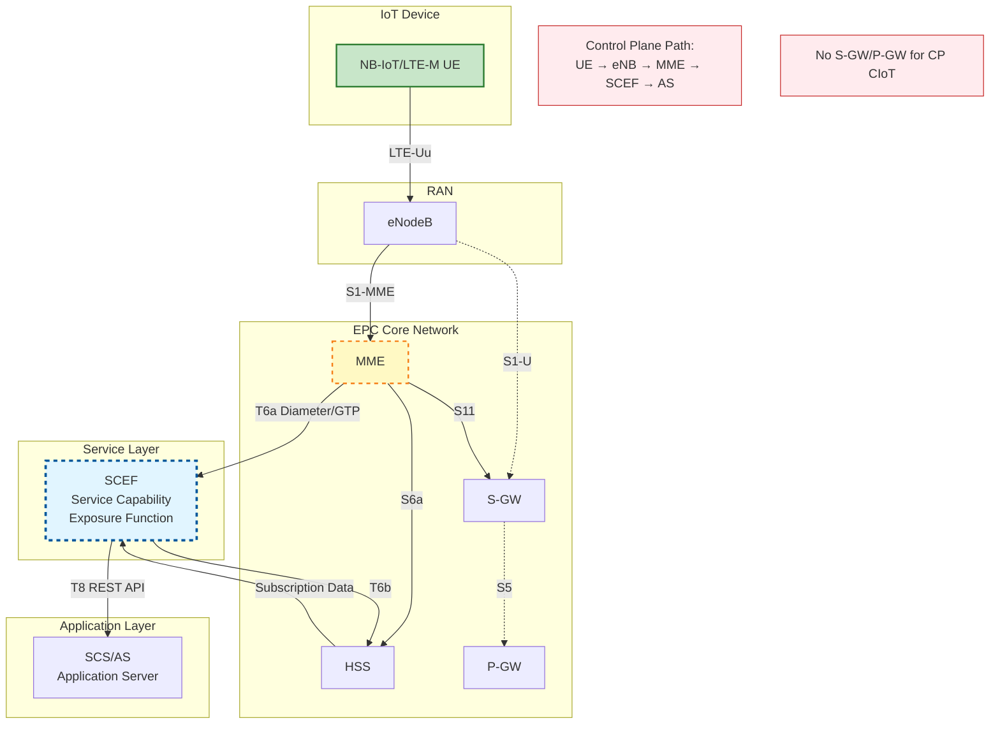

# NIDD Architecture: LTE/EPC with SCEF

## Non-IP Data Delivery in LTE (Release 13+)

### Control Plane CIoT Architecture



### Mobile-Terminated NIDD



### Network Architecture



## NIDD PDN Type Configuration

### HSS Subscription Data

```
Subscriber Profile:
  IMSI: 234501234567890
  External Identifier: sensor-12345@example.com
  MSISDN: +44780012345

  APN: "nidd.iot.operator.com"
    PDN Type: Non-IP
    SCEF ID: scef1.operator.com
    SCEF Realm: operator.com

  Power Saving:
    PSM: Enabled
      T3324 (Active Timer): 60 seconds
      T3412 ext (TAU Timer): 24 hours
    eDRX: Enabled
      eDRX Cycle: 163.84 seconds
      PTW: 10.24 seconds
```

## Message Size Limits

| Transport Method | Max Message Size | Latency | Power | Use Case |
|------------------|------------------|---------|-------|----------|
| CP CIoT (NIDD) | 1600 bytes | ~2-5s | Lowest | Sensor readings, alarms |
| UP CIoT (Suspend/Resume) | Standard IP MTU | ~1-3s | Low | Moderate data, firmware |
| Standard LTE | No limit | <1s | Higher | Video, bulk data |

## Key Specifications

- **TS 23.682**: Architecture enhancements to facilitate communications with packet data networks and applications
  - §5.13.2: NIDD via SCEF
  - §5.13.1: Device triggering
  - §5.13.4: Monitoring event
- **TS 23.401**: GPRS enhancements for E-UTRAN access
  - §5.3.4b: Control Plane CIoT EPS optimization
  - §5.3.4c: User Plane CIoT EPS optimization
- **TS 24.301**: NAS protocol for EPS
  - §6.5.1.4: ESM procedures for Non-IP PDN connection
  - §9.9.4.x: ESM information elements for NIDD
- **TS 29.336**: Home Subscriber Server (HSS) diameter interfaces for interworking with packet data networks and applications (T6a/T6b)
- **TS 29.128**: Tsp interface protocol between the MTC Interworking Function (MTC-IWF) and Service Capability Server (SCS) (T8)
